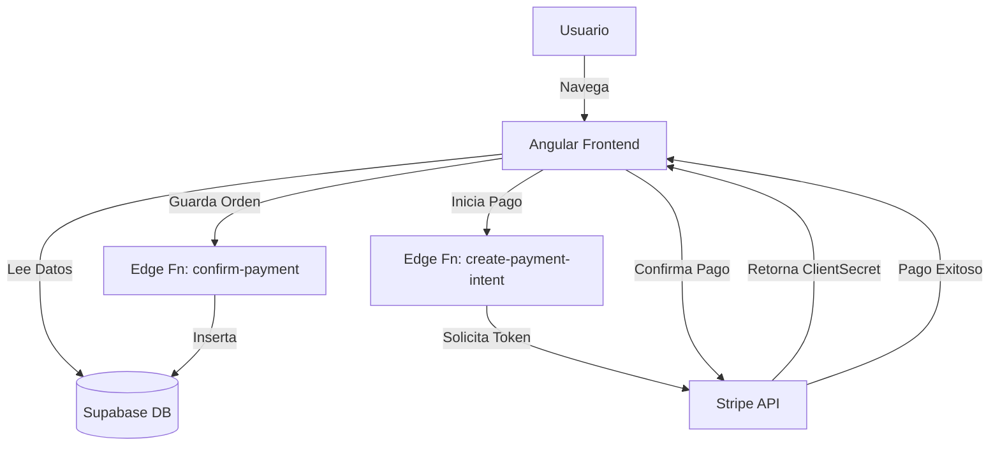

# 🚀 Estado Final del Proyecto Kaelo

**Fecha:** 20 de Noviembre, 2025
**Estado:** ✅ Funcional y Listo para Pruebas

---

## 🏆 Logros Principales

### 1. 💳 Sistema de Pagos Seguro (COMPLETADO)
Hemos implementado una arquitectura de pagos profesional y segura:
- **Frontend:** Integración con Stripe Elements (formulario de tarjeta seguro).
- **Backend:** 3 Edge Functions en Supabase para procesar pagos sin exponer claves secretas.
  - `create-payment-intent`: Genera la intención de pago de forma segura.
  - `confirm-payment`: Verifica el pago y guarda la orden en la base de datos.
  - `stripe-webhook`: Escucha eventos de Stripe en tiempo real.
- **Correcciones Clave:**
  - ✅ Solucionado error de compatibilidad Deno/Node.
  - ✅ Solucionado formato de metadata (JSON string).
  - ✅ Implementado flujo correcto `confirmCardPayment`.

### 2. 🛒 E-commerce Completo
- **Catálogo de Productos:** Venta de comida y suplementos.
- **Catálogo de Rutas:** 12 rutas turísticas de Yucatán con precios y detalles.
- **Carrito de Compras:** Persistente y reactivo usando Angular Signals.
- **Checkout:** Flujo completo desde el carrito hasta el pago exitoso.

### 3. 🗺️ Mapas y Geolocalización
- **Mapa de Tiendas:** Visualización interactiva de tiendas en un mapa (`/shop/stores`).
- **Rutas en Mapa:** Previsualización de rutas turísticas.
- **Tecnología:** Leaflet + OpenStreetMap (solución gratuita y potente).

### 4. 💾 Base de Datos (Supabase)
- Tablas estructuradas y relacionadas:
  - `users`, `products`, `stores`
  - `routes` (con geometría para mapas)
  - `orders`, `order_items`, `transactions` (para historial de ventas)

---

## 🏗️ Arquitectura del Sistema

---

## ⚙️ Guía para "Ir a Producción" (Cobros Reales)

Actualmente el sistema está en **Modo de Prueba** (dinero ficticio). Para cobrar de verdad:

1.  **En Stripe Dashboard:**
    -   Activa tu cuenta (verifica identidad y banco).
    -   Cambia el switch a **"Live Mode"**.
    -   Obtén tus claves `pk_live_...` y `sk_live_...`.

2.  **En el Código (Frontend):**
    -   Archivo: `src/environments/environment.development.ts`
    -   Cambio: `stripePublicKey: 'pk_live_TU_CLAVE_REAL'`

3.  **En el Backend (Supabase):**
    -   Comando: `npx supabase secrets set STRIPE_SECRET_KEY=sk_live_TU_CLAVE_SECRETA`
    -   Redesplegar: `npx supabase functions deploy` (para las 3 funciones).

---

## 🧪 Cómo Probar Ahora (Modo Test)

1.  Ve a `/shop/checkout`.
2.  Usa la tarjeta maestra: **`4242 4242 4242 4242`**
3.  Fecha: Futura (ej. `12/25`)
4.  CVC: `123`
5.  ¡El pago será exitoso y se guardará en la base de datos!

---

## 📂 Archivos Clave Creados

-   `src/app/shared/services/payment.service.ts`: Cerebro de los pagos.
-   `src/app/shop/checkout/checkout.component.ts`: Interfaz de pago.
-   `supabase/functions/*`: Lógica segura del servidor.
-   `STRIPE_TEST_CARDS.md`: Lista de tarjetas para pruebas.

¡Gran trabajo! Tienes una plataforma de e-commerce robusta y lista para escalar. 🚀
